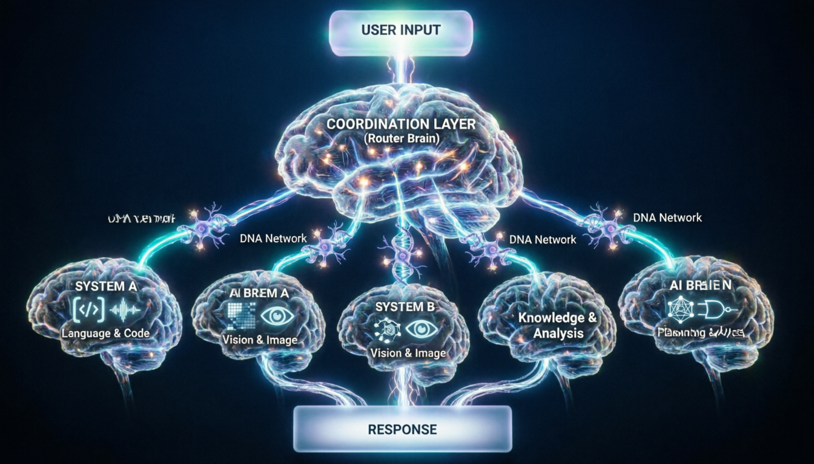

<div align="center">

# 🧠 NBA — Neural Dna Bus Architecture

**A multi-agent AI orchestration framework that enables multiple intelligent systems to operate together through a shared coordination layer.**
## Architecture


</div>

---

## 📋 Overview

NBA introduces a new approach to building AI systems composed of multiple cooperating intelligences. Rather than relying on a single large model to solve every task, the architecture allows several specialized AI capabilities to operate within a unified coordination framework.

The system observes how participating intelligence components process a task and dynamically determines how they should collaborate to produce the most appropriate result. This enables the creation of AI environments where different reasoning capabilities operate together as a coordinated system rather than as isolated models.

---

## 💡 Core Idea

NBA organizes intelligent capabilities into a cooperative structure where each component contributes a specific form of reasoning or perception. A central coordination layer analyzes signals produced during processing and determines how the available capabilities should be combined.

For each task, the system determines the optimal execution strategy. It may route the task to the most suitable capability, combine multiple capabilities to solve complex problems, or execute multi-stage reasoning pipelines across different components.

This design enables the system to function as a **collective intelligence architecture** capable of solving diverse tasks through coordinated decision-making.

---

## 🏗️ Architecture

The design is inspired by how the human brain coordinates specialized regions. Each region performs a different function, yet they communicate through shared neural pathways to produce unified thought and action.

```
                    ┌───────────────────────────┐
                    │        USER INPUT          │
                    │      (Task / Question)      │
                    └─────────────┬───────────────┘
                                  │
                    ╔═════════════▼═════════════╗
                    ║    COORDINATION LAYER      ║
                    ║                            ║
                    ║   Reads internal signals    ║
                    ║   from all systems and      ║
                    ║   determines how they       ║
                    ║   should cooperate          ║
                    ║                            ║
                    ║   Similar to how the        ║
                    ║   prefrontal cortex         ║
                    ║   orchestrates brain        ║
                    ║   regions                   ║
                    ╚═══╤═══════╤═══════╤═══════╝
                        │       │       │
              ┌─────────▼──┐ ┌──▼──────┐ ┌──▼─────────┐
              │  SYSTEM A   │ │ SYSTEM B │ │  SYSTEM N   │
              │             │ │          │ │             │
              │  Language   │ │  Vision  │ │  Reasoning  │
              │  & Code     │ │  & Image │ │  & Math     │
              └──────┬──────┘ └────┬─────┘ └──────┬──────┘
                     │             │              │
                     └─────────────┼──────────────┘
                                   │
                    ┌──────────────▼──────────────┐
                    │          RESPONSE            │
                    │                              │
                    │   Output generated by the    │
                    │   most appropriate           │
                    │   combination of systems     │
                    └──────────────────────────────┘
```

> Just as the brain does not activate every region for every thought, NBA does not engage every system for every task. The coordination layer determines which systems to activate and how they should interact, producing efficient and intelligent responses.

---

## ⚡ Capabilities

| Capability | Description |
|:---|:---|
| **Multi-Intelligence Coordination** | Enables multiple AI capabilities to operate as a unified system |
| **Scalable Architecture** | Designed to support expanding ecosystems of intelligent components |
| **Adaptive Task Routing** | Dynamically selects the most suitable capability for each input |
| **Collaborative Reasoning** | Supports complex workflows across multiple stages |
| **Extensible Design** | New capabilities integrate without restructuring existing components |

---

## 🎯 Potential Applications

| Domain | Use Case |
|:---|:---|
| Multi-Expert AI | Specialized models working together |
| Coordinated Reasoning | Complex multi-step problem solving |
| Adaptive Platforms | Self-optimizing AI systems |
| Orchestration Frameworks | Intelligent model management |
| Distributed AI | Scalable multi-node intelligence |

---

## 🔒 Intellectual Property Notice

This project and its architecture are the intellectual property of **Ammar Alrubayie**. The concepts, system design, architecture description, and implementation associated with **Neural Bus Architecture (NBA)** are protected intellectual property. Unauthorized reproduction, implementation, commercial use, or redistribution of this architecture without explicit written permission from the author is strictly prohibited.

---

## 📊 Status

> **Functional research system demonstrating coordinated multi-intelligence inference.**

---

## 📄 License

**Proprietary — All Rights Reserved**

© 2025 **Ammar Alrubayie**. This software and its architecture are proprietary. No part of this project may be reproduced, distributed, or used without explicit written permission from the author.

📧 For licensing inquiries: [ergellabban@gmail.com](mailto:ergellabban@gmail.com)
